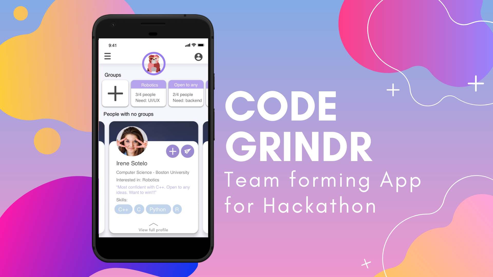
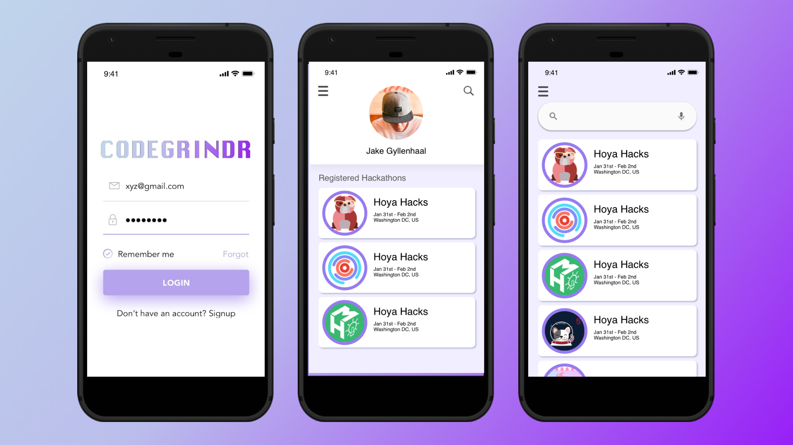
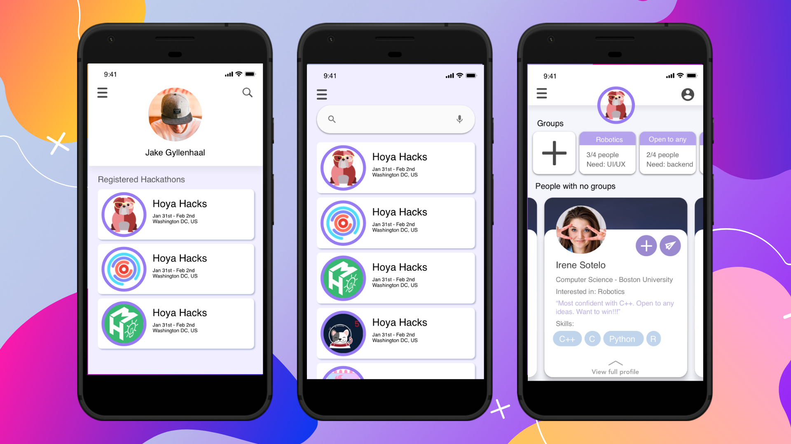
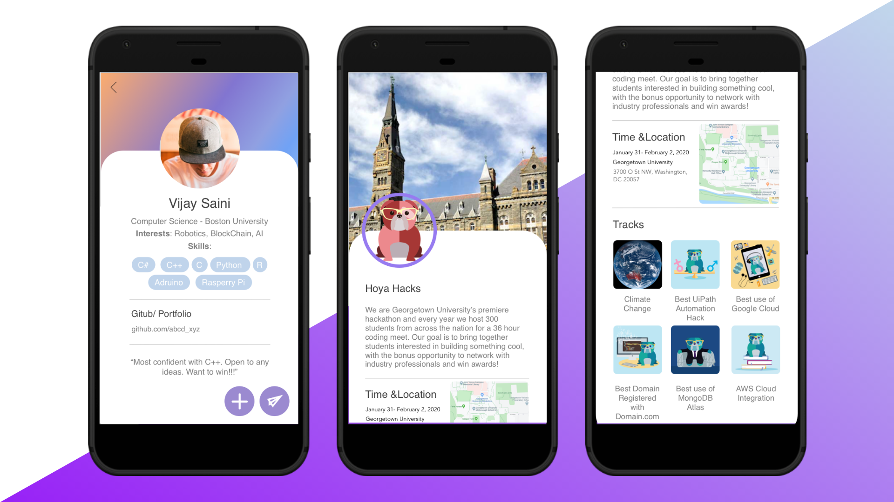
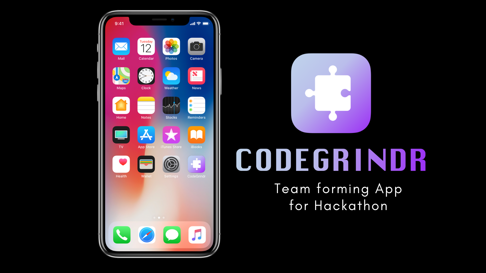
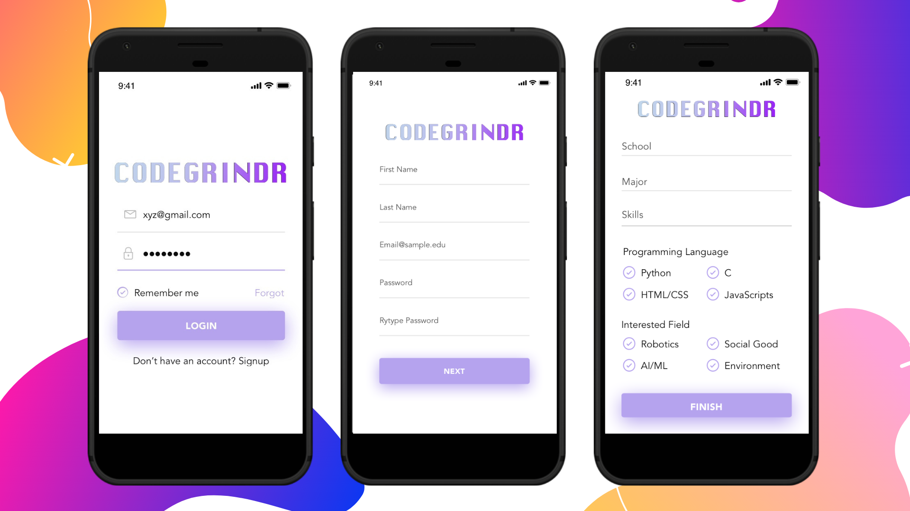

# CodeGrindr
Finding the right teammates is a crucial step for a successful project. We proudly present a social platform to let hackathon's goers to match, interact, and form teams.

# Overview
The app matches the user with other teammates to create a best-matched team. Criteria for matching is to ensure a team is formed by people with different skills but necessary for a successful project.

We used Android Studio to build a native Java mobile app. Then create a Firebase database to draw user info. The backend code then linked to tools and methods in android studio to allow user to search and match with their potential teammates.

# Prototype

 
 
